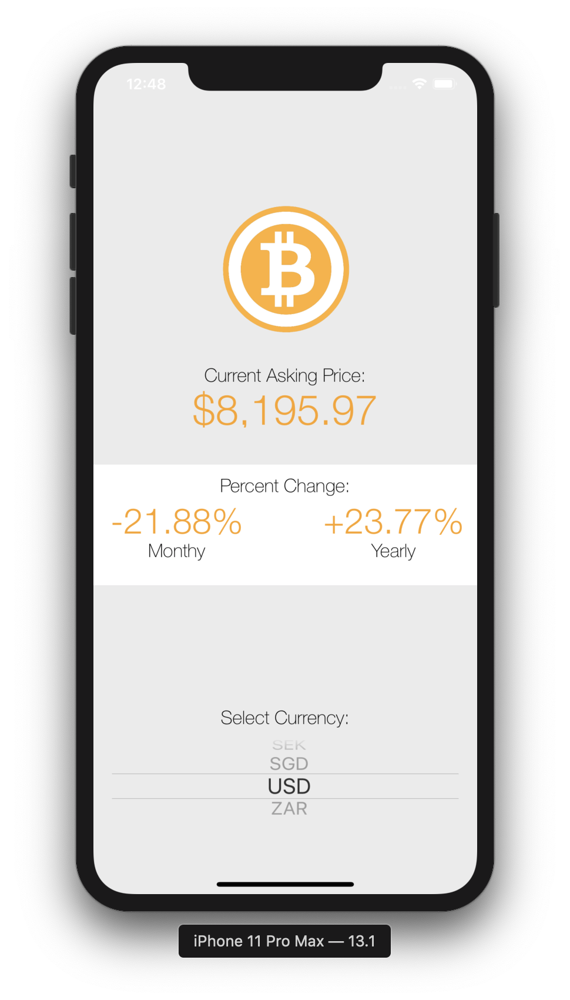

#  Bitcoin Ticker

## The Project

The objective of this challenge from The App Brewery iOS bootcamp was to apply the skills I learned and make a Bitcoin price reporter. The app gives the user the latest Bitcoin prices in all the popular, traded currencies, so they can track how well their Bitcoin investments are doing on the go. I used Cocoapods, networking calls and JSON parsing to make this small ticker app. I aslo deviated from the course to to make it more functional with month-to-date change in price as well as year-to-date change.

